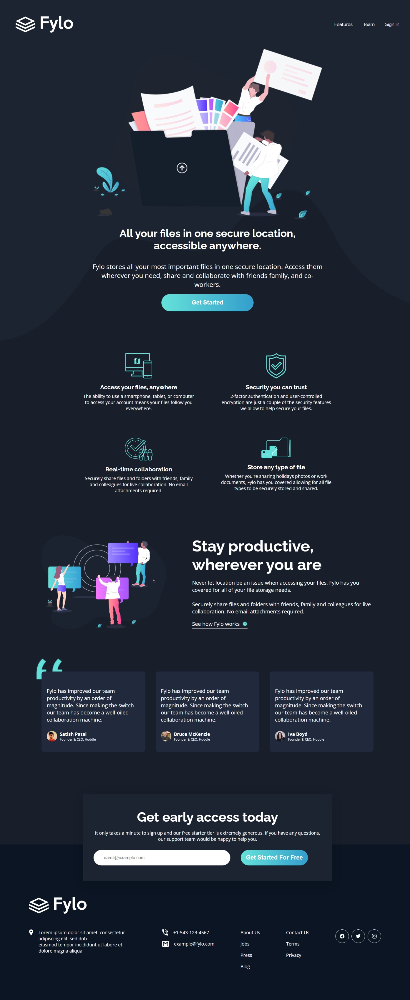

# Fylo Dark Theme Landing Page

A responsive landing page challenge from [Frontend Mentor](https://www.frontendmentor.io/challenges/fylo-dark-theme-landing-page-7ozYp0eE).  
Built with semantic HTML, modern CSS, and vanilla JavaScript for form validation.

---

## Features

- Responsive layout for desktop, tablet, and mobile
- Semantic HTML5 structure
- Custom CSS variables for easy theming
- Accessible navigation and forms
- Email validation with user feedback
- Fully responsive grid and flex layouts

---

## Screenshots

### Desktop



### Mobile


---

## Getting Started

1. **Clone the repo:**
   ```bash
   git clone https://github.com/your-username/fylo-dark-theme-landing-page.git
   ```
2. **Open the project folder:**
   ```
   cd fylo-dark-theme-landing-page/project
   ```
3. **Open `index.html` in your browser.**

---

## Folder Structure

```
project/
  ├── images/
  ├── index.html
  ├── style.css
  └── script.js
```

---

## Credits

- Challenge by [Frontend Mentor](https://www.frontendmentor.io/)
- Coded by [Your Name]

---

## Live Demo

[live-site](https://vedantobaleppanavar.github.io/Fylo-Dark-Theme-Landing-Page/)
